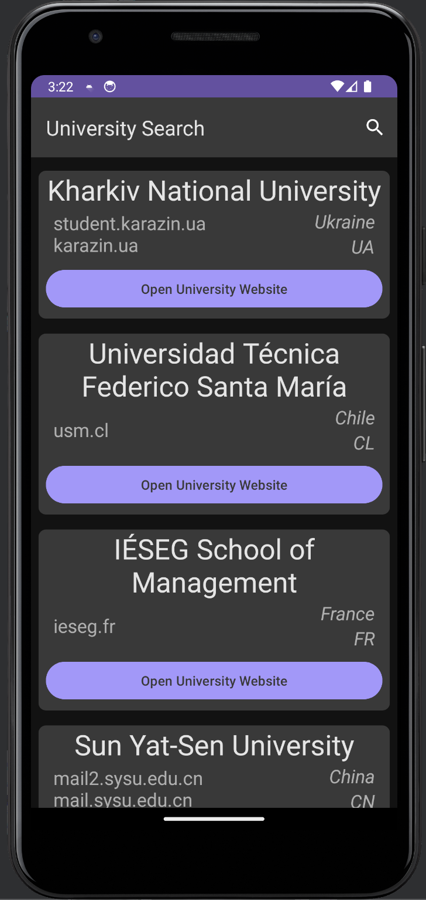
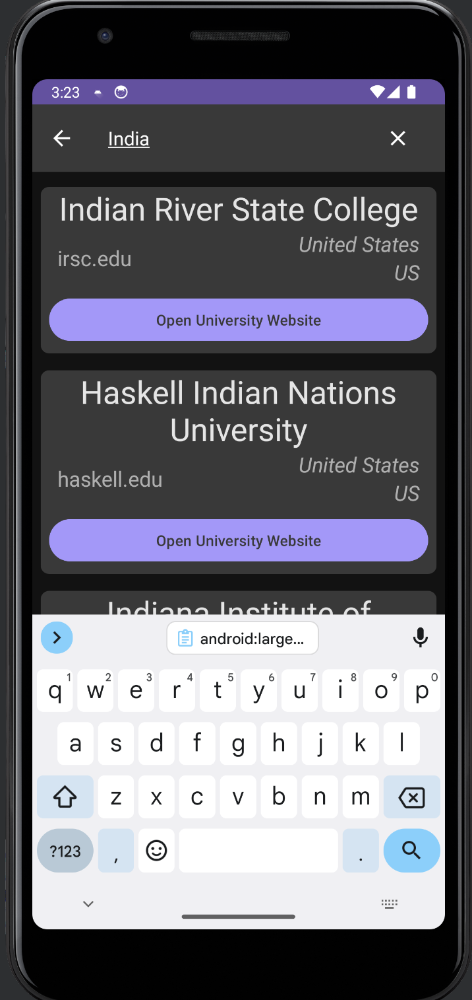
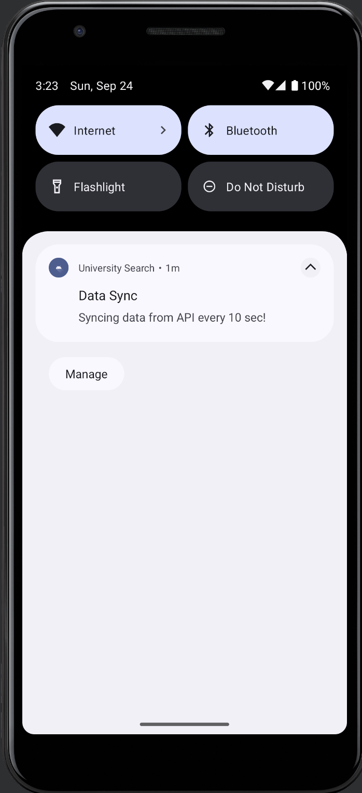

# University Search

An Android application built with Kotlin that fetches university data from the [Universities API](http://universities.hipolabs.com/search) at regular intervals using a foreground service. The app displays university information using a RecyclerView and efficiently updates the list using DiffUtil. It preserves data during configuration changes like orientation changes by utilizing ViewModels. Additionally, it provides a search feature to allow users to search for specific universities.

## Table of Contents

- [Features](#features)
- [Screenshots](#screenshots)
- [Prerequisites](#prerequisites)
- [Installation](#installation)
- [Usage](#usage)
- [Libraries Used](#libraries-used)
- [Contact](#contact)

## Features

- Fetch university data every 10 seconds using a foreground service.
- Display a list of universities with their names, domains, and countries.
- Efficient data update using DiffUtil when the list refreshes.
- Open university websites in-app.
- Preserve data on configuration changes using ViewModels.
- Search for universities by its name.

## Screenshots
[Watch the Demo Video](https://youtube.com/shorts/Z9AUpptrSGU?si=AVA8ljIMpF2eetM0)
<table>
  <tr>
    <td style="text-align:center;">
      
    </td>
    <td style="text-align:center;">
      
    </td>
    <td style="text-align:center;">
      
    </td>
    <td style="text-align:center;">
      
    </td>
  </tr>
</table>


## Prerequisites

Before you begin, ensure you have met the following requirements:

- Android Studio with the latest Kotlin plugin installed.
- An active internet connection to fetch university data.
- Android device or emulator with API level 24 or higher.

## Installation

1. Clone this repository:

   ```bash
   git clone https://github.com/gufran-ops/UniversitySearch.git
2. Open the project in Android Studio.

3. Build and run the application on your Android device or emulator.

## Usage

### 1. Launch the App

Upon launching the app, the following features are available:

### 2. Data Fetching

- University data is fetched from the [Universities API](http://universities.hipolabs.com/search) every 10 seconds using a foreground service.

### 3. University List

- The list of universities is displayed in a RecyclerView.

### 4. Opening University Websites

- To open a university's website in-app, simply tap on the university of your choice in the list.

### 5. Searching for Universities

- Use the search bar located at the top to search for universities by their name.

### 6. Data Persistence

- The app leverages ViewModels to ensure that data is preserved during configuration changes, such as orientation changes. This means that even if you rotate the device, the university list and search results remain intact.

## Libraries Used

The following libraries are used in this project:

- **Volley**: Used for making API requests and fetching university data.
- **RecyclerView and DiffUtil**: Employed for displaying the university list and efficiently updating it when data is refreshed.
- **ViewModel**: Ensures that data is preserved on configuration changes.
- **CardView**: Used for making each University list item


## Contact

If you have any questions please feel free to reach out to me:

**Your Name**
- Email: gufran022december@gmail.com
- GitHub: [yourusername](https://github.com/gufran-ops)


